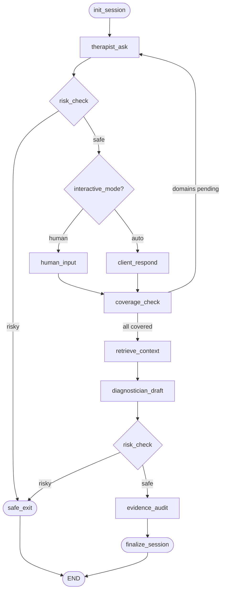

# ICD-11 Multi-Agent RAG System

[](https://www.python.org/downloads/)
[](LICENSE)
[](https://github.com/psf/black)
[](https://github.com/astral-sh/ruff)
[](https://www.mypy-lang.org/)

An educational clinical interview simulator that orchestrates **four specialized LLM agents** via a **LangGraph state machine**, grounded by a **hybrid RAG pipeline** (dense + BM25) over the ICD-11 classification document, all running locally on Apple Silicon with no external API calls.

> **Disclaimer:** This is a research and educational tool. It is **not** a clinical decision support system and must **never** be used to make or inform real diagnostic decisions. All sessions are simulated.

---

## What It Does

The system simulates a structured psychiatric intake interview. A Therapist agent explores 11 clinical domains with the patient; a Client agent (or a human via Streamlit) responds. Once coverage is complete, a Diagnostician agent maps the presentation to ICD-11 codes using retrieved guideline chunks, and an Evidence Auditor verifies claim traceability.

```
Therapist ──asks──▶ Client ──responds──▶ coverage_check
                                              │
                                    ◀── loop until all domains covered
                                              │
                                    retrieve_context (RAG)
                                              │
                                    Diagnostician ──▶ Evidence Auditor
                                              │
                                    DiagnosisOutput (JSON)
```

**Key capabilities:**

- **4-agent orchestration**: Therapist, Client, Diagnostician, and Evidence Auditor share state through a typed LangGraph graph
- **Hybrid RAG**: Reciprocal Rank Fusion (RRF) over ChromaDB dense search and BM25 lexical search on the ICD-11 document
- **Bilingual**: Spanish and English throughout: agents, safety checks, prompts, and responses
- **Safety gate**: keyword-based `RiskGate` halts sessions immediately and surfaces crisis resources when sensitive content is detected
- **Local inference**: GGUF models via `llama-cpp-python` with Metal/MPS offload; PubMedBERT embeddings via `sentence-transformers`
- **Two interfaces**: interactive Streamlit UI with LangGraph interrupt/resume, and a REST API (FastAPI)

---

## Architecture

### LangGraph State Machine



All state flows through a single `SessionState` TypedDict, there is no hidden mutable state between nodes.

### 4-Layer Stack

```
┌──────────────────────────────────────────────────────────┐
│   CLI (Click)  ·  FastAPI  ·  Streamlit                  │
│   main.py  ·  apps/api/  ·  apps/ui/                     │
├──────────────────────────────────────────────────────────┤
│   LangGraph State Machine                                │
│   core/orchestration/  (graph, nodes, state)             │
├──────────────────────────────────────────────────────────┤
│   Agents  ·  Safety                                      │
│   core/agents/  ·  core/safety/risk_gate.py              │
├──────────────────────────────────────────────────────────┤
│   Hybrid RAG                                             │
│   ChromaDB (dense)  +  BM25 (lexical)  →  RRF            │
│   core/retrieval/  ·  knowledge/                         │
└──────────────────────────────────────────────────────────┘
```

### Agents

| Agent | File | Role |
|---|---|---|
| **TherapistAgent** | `core/agents/therapist.py` | Generates one open-ended, empathetic question per turn; tracks 11 clinical domains |
| **ClientAgent** | `core/agents/client.py` | Simulates patient responses from a structured profile JSON |
| **DiagnosticianAgent** | `core/agents/diagnostician.py` | Produces a JSON array of `{label, code, confidence, evidence_for, evidence_against}` grounded in retrieved ICD-11 chunks |
| **EvidenceAuditorAgent** | `core/agents/auditor.py` | Verifies claim traceability against the transcript and retrieved chunks; flags unverifiable hypotheses |

All agents extend `BaseAgent`, which wraps `llama-cpp-python`'s `Llama` with retry logic and graceful fallback.

### Hybrid RAG Pipeline

`HybridRetriever` fuses results from:
- **Dense**: ChromaDB vectorstore with PubMedBERT embeddings (`NeuML/pubmedbert-base-embeddings`)
- **Lexical**: BM25Okapi over the same corpus

via **Reciprocal Rank Fusion** (RRF, k=60), returning `top_k_final=6` chunks prioritising those containing ICD-11 codes.

`QueryBuilder` synthesises semantic and exact-match query pairs from the transcript before retrieval.

Ingestion: `PyMuPDF` → structure-aware chunker (1 000 tok, 150 overlap) → ChromaDB persisted at `data/indexes/chroma/`, collection `icd11_es`.

### Safety

`RiskGate` applies regex patterns for suicidal ideation and self-harm in Spanish and English. On detection: sets `risk_detected=True`, halts the graph, and returns a bilingual crisis message with hotline numbers.

---

## Requirements

| Component | Requirement |
|---|---|
| Python | ≥ 3.11 |
| RAM | ≥ 16 GB (LLM ≈ 5 GB + embeddings ≈ 0.4 GB) |
| Storage | ≈ 8 GB (model + index) |
| Accelerator | Apple Silicon (MPS) recommended; CPU fallback supported |
| OS | macOS 13+ (MPS), Linux/Windows (CPU) |

---

## Installation

```bash
# 1. Clone
git clone https://github.com/ketcx/icd11-multiagent-rag.git
cd icd11-multiagent-rag

# 2. Create virtual environment (uv recommended)
uv venv && source .venv/bin/activate
uv pip install -r requirements.txt

# 3. Download models  (~5.5 GB total)
python main.py download_models

# 4. Obtain the ICD-11 PDF and place it at files/cie11.pdf
#    Source: https://www.who.int/standards/classifications/classification-of-diseases

# 5. Build the vector index  (~10–20 min on Apple Silicon)
python main.py ingest --pdf files/cie11.pdf
```

> **Note:** `files/cie11.pdf` is excluded from the repository. You must supply your own copy of the ICD-11 document.

---

## Usage

### Interactive session — Streamlit UI

```bash
python main.py serve
# REST API  →  http://localhost:8000
# UI        →  http://localhost:8501
```

The UI pauses at each therapist turn (`interrupt_before=["human_input"]`) so you can type responses directly.

### Automated session — CLI

```bash
# Run with the bundled anxiety profile
python main.py run --profile evals/profiles/anxiety_basic.json

# Run in English
python main.py run --profile evals/profiles/anxiety_basic.json --language English
```

### Evaluation suite

```bash
python main.py eval --suite evals/suites/standard.yaml
```

### Direct invocation

```bash
# Ingest with explicit config
uv run python main.py ingest --pdf files/cie11.pdf --config configs/app.yaml

# API only
uvicorn apps.api.main:app --host 0.0.0.0 --port 8000 --reload

# UI only
streamlit run apps/ui/app.py
```

---

## Configuration

All tuneable parameters live in `configs/app.yaml`, the single source of truth for model names, paths, retrieval parameters, and agent temperatures.

```yaml
llm:
  model_name: "bartowski/Phi-3-mini-4k-instruct-GGUF"
  model_file: "Phi-3-mini-4k-instruct-Q4_K_M.gguf"
  n_ctx: 4096
  n_gpu_layers: -1          # -1 = full Metal/MPS offload

embeddings:
  model_name: "NeuML/pubmedbert-base-embeddings"
  device: "mps"

retrieval:
  collection_name: "icd11_es"
  top_k_dense: 8
  top_k_bm25: 8
  top_k_final: 6

agents:
  therapist:
    temperature: 0.7
    max_tokens: 256
  diagnostician:
    temperature: 0.3        # Low for deterministic output
    max_tokens: 1024

session:
  max_turns: 40
  domains:
    - mood
    - anxiety
    - sleep
    - eating
    - substances
    - psychosis
    - trauma
    - ocd
    - cognition
    - social_functioning
    - suicidal_ideation
```

To swap the LLM, update `llm.model_name` and `llm.model_file`; all downstream scripts read from this file.

---

## Client Profile Schema

Sessions are driven by JSON profiles in `evals/profiles/`:

```json
{
  "profile_id": "anxiety_basic",
  "demographics": {
    "name": "Alex",
    "age": 34,
    "gender": "non-binary"
  },
  "presenting_complaints": ["excessive worry", "insomnia", "restlessness"],
  "history": "Work-related stress for 6 months. No prior psychiatric history.",
  "language": "Español"
}
```

See `evals/profiles/schema.json` for the full JSON Schema definition.

---

## Session Output

Completed sessions are serialised to `runs/<session_id>.json` as a `DiagnosisOutput` Pydantic object:

```json
{
  "session_id": "sess_20260601_142300",
  "timestamp": "2026-06-01T14:23:00Z",
  "coverage": {
    "domains_covered": ["mood", "anxiety", "sleep"],
    "domains_pending": []
  },
  "hypotheses": [
    {
      "label": "Generalised Anxiety Disorder",
      "code": "6B00",
      "confidence": "HIGH",
      "evidence_for": ["excessive and persistent worry", "sleep disturbance"],
      "evidence_against": []
    }
  ],
  "audit_report": {
    "traceability_score": 0.91,
    "issues": []
  }
}
```

---

## Project Structure

```
icd11-multiagent-rag/
├── main.py                     # CLI entry point (Click)
├── configs/
│   └── app.yaml                # Single source of truth for all config
├── core/
│   ├── agents/                 # LLM agents + factory
│   │   ├── __init__.py         # create_llm() factory (llama-cpp-python)
│   │   ├── base.py             # BaseAgent with retry + fallback
│   │   ├── prompts.py          # System prompts (English + Spanish)
│   │   ├── therapist.py
│   │   ├── client.py
│   │   ├── diagnostician.py
│   │   └── auditor.py
│   ├── orchestration/          # LangGraph state machine
│   │   ├── state.py            # SessionState TypedDict
│   │   ├── graph.py            # Graph + conditional routing
│   │   └── nodes.py            # Node functions
│   ├── retrieval/              # Hybrid RAG
│   │   ├── __init__.py         # Pipeline init
│   │   ├── retrievers.py       # HybridRetriever (dense + BM25 + RRF)
│   │   └── query_builder.py    # QueryBuilder
│   ├── safety/
│   │   └── risk_gate.py        # RiskGate (bilingual keyword safety)
│   └── schemas/
│       ├── session.py
│       └── diagnosis.py        # Hypothesis, DiagnosisOutput (Pydantic)
├── knowledge/
│   ├── ingest/
│   │   ├── pdf_parser.py       # PyMuPDF extraction with heading/code detection
│   │   └── normalizer.py       # Text normalization
│   └── indexing/
│       ├── chunker.py          # Structure-aware chunker
│       └── chroma_builder.py   # ChromaDB persistence
├── apps/
│   ├── api/                    # FastAPI REST API
│   │   ├── main.py
│   │   └── routers/
│   │       ├── health.py       # GET /health
│   │       ├── sessions.py     # POST /sessions, GET /sessions/{id}
│   │       └── batch.py        # POST /batch
│   └── ui/
│       └── app.py              # Streamlit UI (interrupt/resume)
├── evals/
│   └── profiles/               # Client profile JSONs + JSON Schema
├── scripts/
│   ├── download_models.py      # HuggingFace Hub downloads
│   ├── diagnose_chroma.py      # ChromaDB diagnostics
│   └── validate_rag.py         # Retrieval quality diagnostics
├── tests/
│   ├── conftest.py
│   └── test_*.py
```

---

## Development

```bash
# Install dev dependencies
uv pip install -e ".[dev]"

# Lint (ruff) + type-check (mypy)
make lint

# Format (black + ruff --fix)
make format

# Tests
make test

# All checks
make all
```

### Running tests

```bash
pytest tests/ -v --tb=short
```

---

## How It Works — Step by Step

1. **Ingestion**: The ICD-11 PDF is parsed by PyMuPDF, chunked respecting section boundaries, embedded with PubMedBERT, and stored in ChromaDB alongside a BM25 index built from the same corpus.

2. **Session init**: The graph initialises `SessionState` with the client profile and the full list of 11 clinical domains to cover.

3. **Interview loop**: The Therapist asks one question per pending domain; the Client (or human) responds. The `RiskGate` checks every turn. After each response, `coverage_check` decides whether to loop or proceed to diagnosis.

4. **RAG retrieval**: `QueryBuilder` synthesises semantic and exact-match queries from the transcript; `HybridRetriever` fuses dense and BM25 results via Reciprocal Rank Fusion.

5. **Diagnosis**: The Diagnostician produces a structured JSON hypothesis array grounded in retrieved ICD-11 chunks; output is validated against the `Hypothesis` Pydantic schema.

6. **Audit**: The Evidence Auditor verifies that each `evidence_for` claim is traceable to a retrieved chunk or transcript turn, computing a `traceability_score`.

7. **Output**: A `DiagnosisOutput` object is written to `runs/<session_id>.json`.

---

## Limitations

- **Model size**: Phi-3-mini is a 3.8 B parameter model. Diagnostic output quality is constrained; larger models will produce richer hypotheses.
- **Safety gate**: `RiskGate` uses keyword matching, not semantic understanding. It may miss subtle expressions of distress and should never be relied upon for real safety screening.
- **Retrieval quality**: Depends on the ICD-11 PDF version provided, OCR quality, and chunking parameters.
- **Not validated**: This system has no clinical validation and no regulatory approval of any kind.

---

## Contributing

Contributions are welcome. Please:

1. Fork the repository and create a feature branch (`git checkout -b feat/your-feature`)
2. Ensure `make all` passes (lint + format + tests)
3. Add or update tests for any changed behaviour
4. Submit a pull request with a clear description of the change and its motivation

For significant changes, open an issue first to discuss the approach.

---

## License

MIT License, see [LICENSE](LICENSE) for details.

---

## Citation

If you use or adapt this system in your research, please cite:

```bibtex
@software{icd11_multiagent_rag,
  title  = {{ICD-11 Multi-Agent RAG}: An Educational Clinical Interview Simulator},
  year   = {2026},
  url    = {https://github.com/ketcx/icd11-multiagent-rag}
}
```
